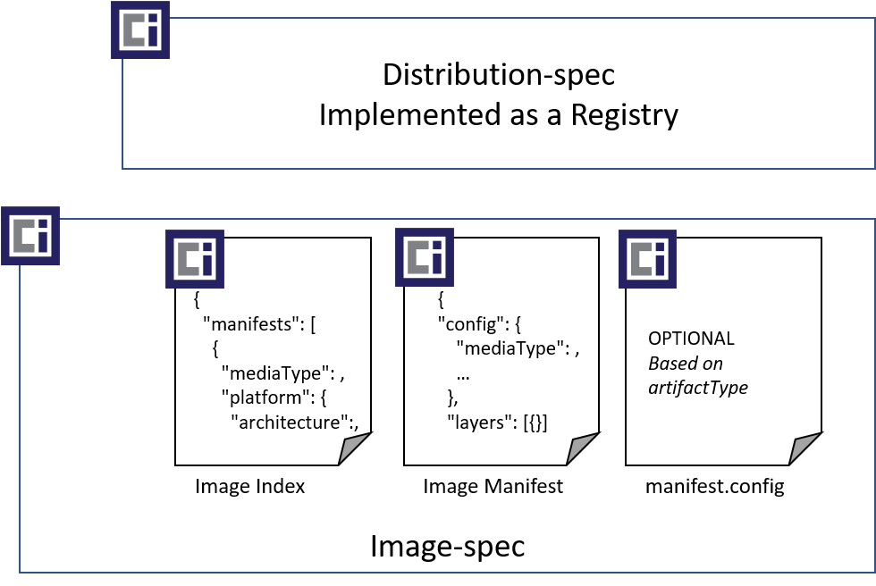
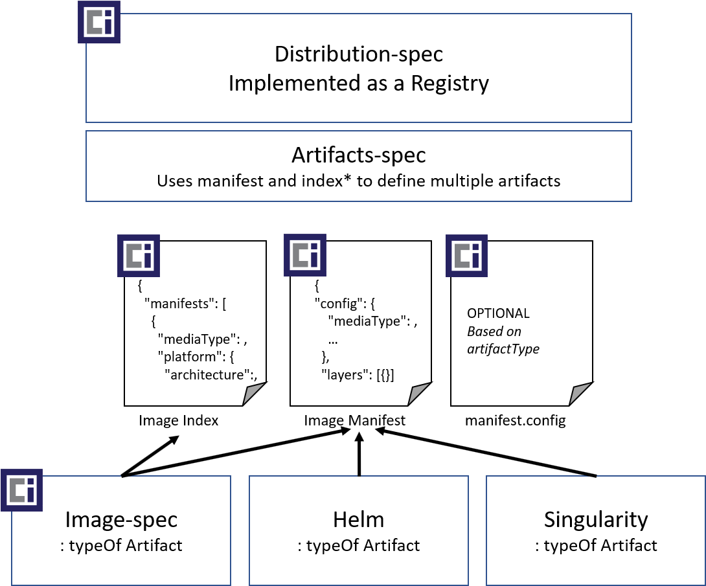

# Open Containers Initiative

## Artifact Authors Guidance
This reference provides guidance for authoring new artifact types.

## OCI Artifacts Support

OCI Artifacts provides a reference for artifact authors and registry implementors to support new artifact types with pre 1.0 implementations of the [distribution-spec][distribution-spec]. More particularly, this repository has been [tasked by the OCI TOB to serve 3 primary goals](https://github.com/opencontainers/tob/blob/master/proposals/artifacts.md):

1. **Artifact Authors** - guidance for authoring new artifact types, including a clearing house for [well known][def-well-known-types] artifact types.
1. **Registry Operators and Vendors** - guidance for how operators and vendors can support new artifact types, including how they can opt-in or out of well known artifact types. Registry operators that already implement `mediaType` filtering will not have to change. The artifact repo will provide context on how new `mediaTypes` can be used, and how `mediaTypes` can be associated with a type of artifact.
1. **Clearing House for [Well-known Artifacts][def-well-known-types]** - artifact authors can submit their artifact definitions, providing registry operators a list by which they can easily support.

## Dependencies for the Guidance Provided by this Reference

- [Scope](#scope)
- [Defining OCI Artifact Types](#defining-oci-artifact-types)
- [Defining a Unique Artifact Type](#defining-a-unique-artifact-type)
- [Defining Supported Layer Types](#defining-supported-layer-types)
- [Optional: Defining Config Schema](#optional-defining-config-schema)
- [Registering Unique Types with IANA](#registering-unique-types-with-iana)
- [References](#references)

## Scope

This reference is dependent on [OCI manifest][image-manifest] 1.0 to represent individual artifact types including [OCI Image][image-spec], [Helm][helm] and [Singularity][singularity].

### Future Scope

Future versions will support new artifact types representing collections of artifacts using [OCI Index][image-index]. A means to identify an index as a type of artifact will be required.

## Defining OCI Artifact Types

As registries become content addressable distribution points, tools that pull artifacts must know if they can operate on the artifact. Artifact types are equivalent to file extensions.

A set of comparable file extension use cases include:

- When users open files, the host operating system typically launches the appropriate program.
- When users open a file, from within a program, the open dialog filters to the supported types.
- When search or security software scan the contents of a storage solution, the software must know how to process the different types of content.
- When users view the storage contents, information about the content is rendered based on the derived type(s) of the content being shown.

OCI Artifacts enables these use cases for [OCI distribution spec][distribution-spec] based registries by specifying a `manifest.config.mediaType` on the content pushed to a registry.

### Visualizing Artifacts

The manifest `config.mediaType` is the equivalent of a file extension, enabling artifact type differentiation. An example of completed artifacts follows:

|Icon|Artifact|`config.mediaType`|
|-|-|-|
||[OCI Image][image-spec]|`application/vnd.oci.image.config.v1+json`|
||[Helm Chart](https://helm.sh)|`application/vnd.cncf.helm.chart.config.v1+json`|
||[Singularity][singularity], by [Sylabs][sylabs]|`application/vnd.sylabs.sif.config.v1+json`|

## Defining a Unique Artifact Type

A unique artifact type is similar to defining a file extension. Defining a unique artifact allows various tools to know how to uniquely work with the type. It allows a registry to display the type and tooling, such vulnerability scanners, a means to know if and how they should interact with the contents.

Defining a unique type involves uniqueness for computer processing, and uniqueness for humans.

For computer processing, artifacts are defined by setting the `manifest.config.mediaType` to a globally unique value.

> **Note:** The `config.mediaType` of `application/vnd.oci.image.config.v1+json` is reserved for artifacts intended to be run and instanced by [docker][docker], [containerd][containerd] and other [OCI Image][image-spec] runtimes and tool chains.

Each new artifact type MUST be uniquely defined. See [registering unique types with IANA](#registering-unique-types-with-iana) for registering unique [well-known][def-well-known-types] mediaTypes.

Each `mediaType` SHOULD use all lower case characters. Multi-part names MAY concatenate words, or use `-` to separate words. eg: (`subtype`, `sub-type`)

The following `config.mediaType` format is used to differentiate the type of artifact:

`[registration-tree]`.`[org|company|entity]`.`[objectType]`.`[optional-subType]`.config.`[version]`+`[optional-configFormat]`

- **`registration-tree`** - represents an IANA root tree. See [iana registration trees][iana-trees] for public and private tree options.
- **`org|company|entity`** - represents an open source foundation (`oci`, `cncf`) or a company (`microsoft`, `ibm`) or some unique entity.
- **`objectType`** - a value representing the short name of the type.
- **`optional-subType`** - provides additional extensibility of an `objectType`
- **`version`** - provides artifact authors the ability to revision their schemas and formatting, enabling tools to identify which format they will process.
- **`optional-configFormat`** - while `config.mediaType` represents the unique identifier of an artifact, providing a config object is optional. If a config object is provided, `.json`, `.yaml` or other standard textual formats are preferred. By utilizing standard text formats, registry operators MAY parse the contents to provide additional context to users. If the config object is null, the `optional-configFormat` MUST be empty.

### Example `config.mediaTypes`

|Artifact Type|mediaType|
|-|-|
| null config | `application/vnd.oci.null-sample.config.v1`|
| Config as `.json` | `application/vnd.oci.json-sample.config.v2+json`|
| Config as `.yaml` | `application/vnd.oci.yaml-sample.config.v3+yaml`|

See [visualizing artifacts](#visualizing-artifacts) for additional `mediaType` examples.

## Defining Supported Layer Types

The content of an artifact is represented through a collection of layers and an optional config object. The layers of an artifact may be independent files, collections of files, or ordered collection of tarballs persisted as blobs within a registries storage provider.

Defining artifact layers involves:

1. [Defining layer content, understanding layer de-duping](#layer-content-format)
1. [Optional versioning of layer content](#layer-versioning)
1. [Defining `layer.mediaTypes`](#defining-layermediatypes)

As an example, [OCI Images][image-layer] are represented through an ordered collection of tar archives. Each tar archive represents a layer. Each layer overlays the previous layer.

Some artifacts may be represented as a single file, such as a config artifact representing a deployment details for an application. While other artifacts may include a config object, and a collection of binaries compressed as yet another layer. By separating the layers, the artifact author can benefit from layer de-duplication and concurrent downloading of each layer using various distribution-spec clients. How an artifact client processes layers, merging them with overlay, or extracting them to different locations or hosts is up to the artifact authors.

### Layer Content Format

The content layer format is up to the artifact author and may utilize standard or custom formats. Authors are encouraged to utilize existing formats which may benefit from existing libraries to parse those formats. Authors may choose to persist individual files with standard or custom formats, such as `.json`, `.yaml`, `.bin`, `.sif`, or store a collection of files as a `.tar` archive. Optionally, the author MAY choose to compress the contents. The extension of the `layer.mediaType` MUST reflect the format of the blob and its optional compression.

Artifacts authors may define different layers for a range of reasons:

1. Split layers due to size:
    - Splitting an artifact into multiple layers enables concurrent downloading.
    - Some artifacts will benefit from common layers, such as OCI Images having common base layers and/or common framework/runtime layers.  
    For example, in OCI, the layers are ordered where each layer overlays the previous layer, creating a unified collection of files.  
    All layer types are the same, with the position in the index being the important aspect.
1. Split layers for different groupings, reuse and optimization:
    - An artifact may have non-unique environmental config and runtime collections of files. The runtime layer is sent to a host, while the configuration information may be sent to another location on the same host, or to a different host altogether.
    - Layers may split for different localization options, where an artifact client can determine which layers it requires for locales and language requirements. The runtime layer, or the localization layers may be individually updated, isolating the storage and download time for delta changes.
    - Layers may include optional source code, licenses or software bill of materials (SBoM) that are required for legal requirements or policy management. Different elements of a pipeline may pull the layers they require, while saving bandwidth, memory and compute processing for the layers they don't require.
    - In these cases, the ordered position of the layer may not be important, rather the sub-type of the layer identifies its purpose.

#### De-duping Layers

When designing layer formats, consider how a registry may de-dupe layers that share the same content across different artifacts. Layers may be shared across different instances of an artifact as they're persisted to a registry. The registry may handle de-duping based on the digest of each layer. Artifact layers types are not expected, nor required to be shared across different artifact types. A layer type that represents an OCI Image is not expected to be shared with a helm chart. However, two helm charts that have the same content may be de-duped within the registry. The `layer.mediaType` provides the definition of the contents.

### Layer Versioning

Layer formats that may change should define a version to future proof new enhancements. How the artifact tooling processes forward and backward compatibility is up to the artifact and tooling authors.

### Defining `layer.mediaTypes`

`layer.mediaTypes` fall into 2 categories:

1. **Existing generic formats**: as defined by [IANA][iana-media-types].  
    These types are neither artifact nor `vendor|org|entity` specific, nor are they versioned.  
    Generic formats enable simple single layer scenarios, or where there's little to no differentiation between the different layers.
    - [text/*](https://www.iana.org/assignments/media-types/media-types.xhtml#text)
    - [application/json](https://www.iana.org/assignments/media-types/application/json)
    - [application/xml](https://www.iana.org/assignments/media-types/application/xml)
1. **Vendor|Org|Entity definitions**: identify different versioned layer types within the same artifact.  
    Unique definitions enable layers to be handled individually without assuming ordered positioning. Each layer may use an existing [IANA][iana-media-types] format, but represent different usages within the artifact type.  
    A Registry Doc artifact (`application/vnd.oci.sample-repo-doc.config.v1`) which represents the contents of a repo cloud be represented as:
    - `application/vnd.oci.sample-repo-doc.summary.layer.v1.md` - used as the readme of a repo, displayed on a registry webpage.
    - `application/vnd.oci.sample-repo-doc.content.layer.v1.tar` - provides detailed documentation, including multiple `.md` files for offline reading.

**Vendor|Org|Entity definitions** utilize the `layer.mediaType` with the following format:  
`[registration-tree]`.`[org|company|entity]`.`[layerType]`.`[optional-layerSubType]`.layer.`[version]`.`[fileFormat]`+`[optional-compressionFormat]`

- **`registration-tree`** - represents an IANA root tree. See [iana registration trees][iana-trees] for public and private tree options.
- **`org|company|entity`** - represents an open source foundation (`oci`, `cncf`), a company or some unique entity.
- **`layerType`** - a value representing the short name of the type.
- **`optional-layerSubType`** - provides additional extensibility of a `layerType`
- **`version`** - provides artifact authors the ability to revision their schemas and formatting, enabling tools to identify which format they will process. Using a version enables artifact tools to identify the format for processing.
- **`fileFormat`** - provides for standard, or custom formats, enabling artifact authors to leverage existing or custom content processing libraries.
- **`optional-compressionFormat`** - in addition to the fileFormat, optional compression is used. (eg: `+gzip`, `+zstd`)

### Example Layer Types

| Artifact Type | mediaType |
| - | - |
| Simple text file layer | `application/text` |
| Non-compressed OCI Image layer | `application/vnd.oci.image.layer.v1.tar` |
| [gzip] Compressed OCI Image layer | `application/vnd.oci.image.layer.v1.tar+gzip` |
| [gzip] Compressed Docker Image layer | `application/vnd.docker.image.rootfs.diff.tar+gzip` |
| Non-compressed Helm Chart layer | `application/vnd.cncf.helm.chart.layer.v1.tar` |
| [gzip] Compressed Helm Chart layer | `application/vnd.cncf.helm.chart.layer.v1.tar+gzip` |
| Singularity SIF layer | `application/vnd.sylabs.sif.layer.v1.sif` |
| Sample Doc Artifact Summary layer | `application/vnd.oci.sample-repo-doc.summary.layer.v1.md` |
| Sample Doc Artifact Content layer| `application/vnd.oci.sample-repo-doc.content.layer.v1.tar` |

## Optional: Defining Config Schema

When defining an artifact type, the persistence of the artifact may be broken up into content and configuration. Configuration may be stored as a layer, or it may be stored and referenced by the `manifest.config`.

While the value of `manifest.config.mediaType` is used to determine the artifact type, the persistance of a `config` object is OPTIONAL. Artifacts can push a null reference for `config.json` persistance.

Some benefits of placing content in `manifest.config` include:

- Tooling can pull the configuration object prior to layers. An artifact component may use the config to determine how and where the layer should be instantiated. The artifact component might send layer request to different compute instances, such as OCI Image layers being distributed differently based on the target OS.
- Registries may opt-into parsing the `manifest.config` object if it provides meaningful top-level information. For example, [OCI Image Config][image-spec-config] stores `OS`, `Architecture` and `Platform` information that some registry operators may wish to display. The config object is easy to pull & parse, as opposed to getting a layer url to pull, possibly decompress and parse.

Registries which implement the artifact spec MAY:

- Parse and process the contents of  `manifest.config`, based on the provided schema of `manifest.config.mediaType`, offering additional information or actions.
- Ignore the contents and validation of the `config` object.

## Registering Unique Types with IANA

New artifact types SHOULD register their unique `config.mediaType` and unique `layer.mediaType` with IANA to assure ownership of the type. [Well-known][def-well-known-types] types MUST register their unique `mediaTypes` to be published for registry consumption.

## References

RFC reference:

- [RFC 6838][rfc-6838]
- [RFC 5226][rfc-5226]

[annotations]:                   https://github.com/opencontainers/image-spec/blob/master/annotations.md
[artifacts]:                     README.md
[containerd]:                    https://containerd.io/
[def-registry]:                  definitions-terms.md#registry
[def-well-known-types]:          definitions-terms.md#well-known-type
[def-yass]:                      definitions-terms.md#yass
[distribution-spec]:             https://github.com/opencontainers/distribution-spec/
[docker]:                        https://github.com/moby/moby
[gzip]:                          https://tools.ietf.org/html/rfc1952
[helm]:                          https://github.com/helm/helm
[iana-registry-media-types]:     https://www.iana.org/form/media-types
[iana-trees]:                    https://tools.ietf.org/html/rfc6838#section-3
[iana-media-types]:              https://www.iana.org/assignments/media-types/media-types.xhtml
[image-manifest]:                https://github.com/opencontainers/image-spec/blob/master/manifest.md
[image-index]:                   https://github.com/opencontainers/image-spec/blob/master/image-index.md
[image-layer]:                   https://github.com/opencontainers/image-spec/blob/master/layer.md
[image-spec]:                    https://github.com/opencontainers/image-spec/
[image-spec-config]:             https://github.com/opencontainers/image-spec/blob/master/config.md
[iso-639-1]:                     https://www.iso.org/iso-639-language-codes.html
[iso-3166-1]:                    https://www.iso.org/iso-3166-country-codes.html
[locale-strings]:                 #setting-locale-strings
[distribution]:                  https://github.com/docker/distribution
[rfc-5226]:                      https://tools.ietf.org/html/rfc5226
[rfc-6838]:                      https://tools.ietf.org/html/rfc6838
[singularity]:                   https://github.com/sylabs/singularity
[sylabs]:                        https://sylabs.io/
[zstd]:                          https://tools.ietf.org/html/rfc8478
