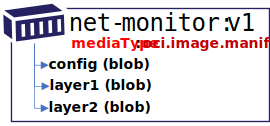
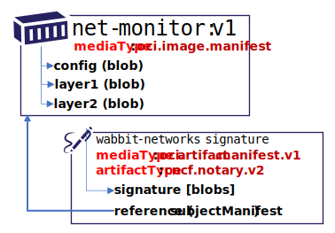
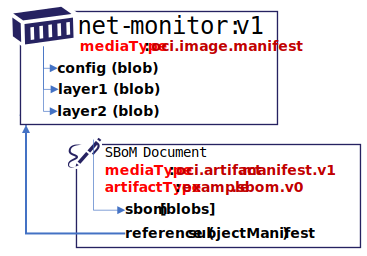
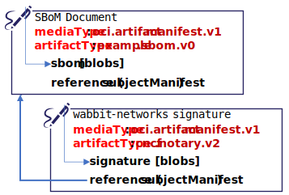
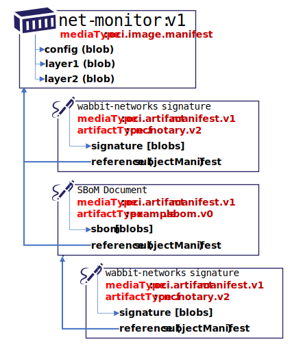
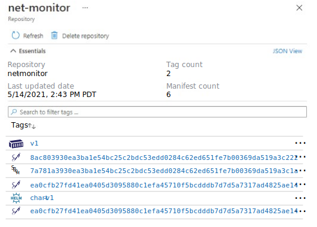
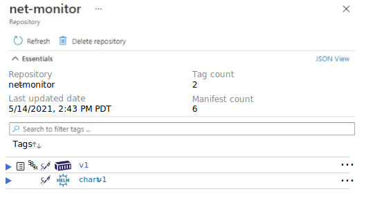
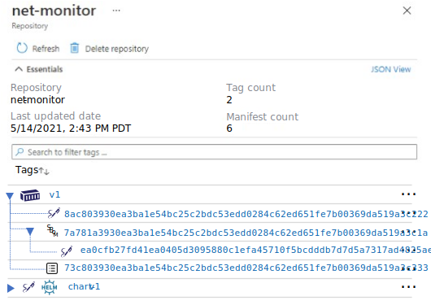
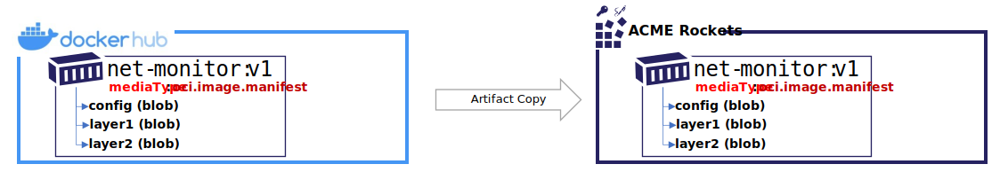
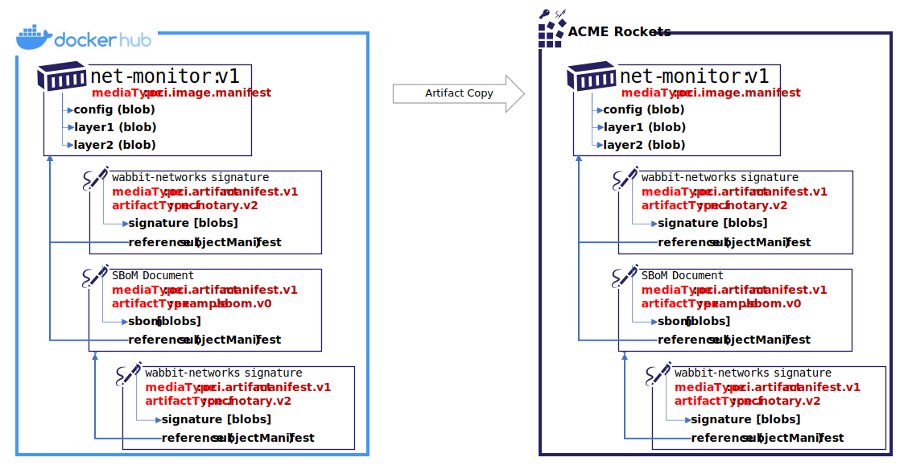

# OCI Artifact Manifest

The OCI artifact manifest generalizes the use cases of [OCI image manifest][oci-image-manifest-spec] by removing constraints defined on the image-manifest such as a required `config` object and required ordinal `layers` collection. The `subjectManifest` property provides a means to define a wide range of artifacts, including a chain of related artifacts enabling SBoMs, on-demand loading, signatures and metadata that can be related to an `image.manifest` or `image.index`.  The addition of a new manifest does not change, nor impact the `image.manifest`. By defining a new manifest, registries and clients opt-into new capabilities, without breaking existing registry and client behavior or setting expectations for scenarios to function when the client and/or registry doesn't yet implement the new capabilities.

# Phased Implementations Through Experimental Releases

To meet pressing timelines for delivering Secure Supply Chain artifacts in the fall of 2021, the spec will be split into two phases:

### Phase 1 - Reference Types

Phase 1 is a time focused release, prioritizing a subset of capabilities needed to support reference types enabling signing and sbom scenarios.

Reference types require:
- **Manifest reference**: a means to add content to a registry, referencing existing, unchanged, content.
- **Reference Discovery API**, where the consumer finds referenced artifacts by querying what artifacts are related to a subject artifact.  
  For example, what signatures or SBoMs are related to the `net-monitor:v1` container image. See the [manifest-referrers api](./manifest-referrers-api.md) for details.
- **Lifecycle management**: as content is added to a registry, how is its lifecycle handled? Can a user can find and delete reference types, and how would a registry garbage collect unreferenced content.  
  As registries implement the [distribution-spec][oci-distribution-spec], content may be stored indefinitely. To assure registries MAY implement garbage collection, a manifest is used to identify the intent of the content. See [Lifecycle Management][lifecycle-management] for details. The spec doesn't dictate how an lifecycle management must be implemented, rather focuses on a set of consistent expectations for users to have when working across different implementations.

To separate the reference type deliverables for the fall of 2021 from future work, a `application/vnd.oci.artifact.manifest.v1+json` is provided.
For spec details on Phase 1, see [artifact-spec.md](./artifact-spec.md)

### Phase 2 - Artifact Versioning Support

Phase 2 will work to enable the full range of scenarios outlined in [WIP generic object spec #37](https://github.com/opencontainers/artifacts/pull/37).

By splitting out **Phase 1** from **Phase 2**, focus is placed upon a subset of capabilities in a short time, while providing time to review and evolve the larger scenarios.

The goal is to migrate phase 1 implementations to phase 2 (derivative of PR #37). It is not the intent to have dozens of manifest types. Phase 1 is a point in time release to meet pressing security requirements for supply chain artifacts, while building knowledge to feed into phase 2.

### Migrating from Phase 1 to Phase 2

Registries that implement phase 1 will likely focus on implementing reverse indexes, supporting the referrers api and lifecycle management to assure untagged reference types aren't automatically deleted. While the manifest format will change, the underlying capabilities for reverse indexes and lifecycle management will be maintained. 

All `oci.artifact.*` based content will be named and versioned, enabling distribution instances and distribution clients to determine the content and how it may be processed.

## Reference Types

There are a new set of scenarios requiring the ability to reference existing artifacts, including the ability to additively sign content or add a SBoM. The addition of a [`subjectManifest`][subjectManifest] property supports linking artifacts through a reference from one artifact manifest to another artifact manifest. By storing these as separate, but linked artifacts, the existing OCI Image tool chain remains unchanged. Tooling that opts into understanding these reference types (eg. SBoM, Notary v2 signatures and Nydus image with on-demand loading) can find the referenced artifacts without changing the existing image tool chains.

### Example OCI Artifact Manifests

- [`net-monitor:v1` oci container image](./artifact-manifest/net-monitor-oci-image.json)
- [`net-monitor:v1` notary v2 signature](./artifact-manifest/net-monitor-image-signature.json)
- [`net-monitor:v1` sample sbom](./artifact-manifest/net-monitor-image-sbom.json)
- [`net-monitor:v1` nydus image with on-demand loading](./artifact-manifest/net-monitor-image-nydus-ondemand-loading.json)

## Reference Type Requirements

Reference type persistance & discovery supports the following requirements:

- Maintain the original artifact digest and collection of associated tags, supporting existing dev through deployment workflows.
- Multiple references per artifact, enabling multiple signatures, SBoMs, images with on-demand loading and other reference types.
- Avoiding the need to tag a reference type to assure its not garbage collected as an untagged manifest.
- Native persistence within an OCI Artifact enabled, distribution spec based registry.
- Copying the graph of references within and across OCI Artifact enabled, distribution spec based registries, enabling an image, its signatures, SBoMs and images with on-demand loading to be copied as a group.

To support the above requirements, reference types (eg signatures, SBoMs, images with on-demand loading) are stored as individual, untagged [OCI Artifacts][oci-artifacts]. They are maintained as any other artifact in a registry, supporting standard operations such as listing, deleting, garbage collection and any other content addressable operations within a registry. Untagged artifacts are considered not ready for garbage collection if they have a reference to an existing artifact. See [Lifecycle Management][lifecycle-management] for spec details.

### Example Image

The `net-monitor:v1` image contains a config and a collection of layers, as defined by the [oci.image.manifest spec][oci-image-manifest-spec].



The `net-monitor:v1` image is persisted as an `oci.image.manifest`, with a unique digest.


- **repository**: `net-monitor`
- **digest**: `sha256:73c803930ea3ba1e54bc25c2bdc53edd0284c62ed651fe7b00369da519a3c333`
- **tag**: `:v1`
> **NOTE:** There is no change to the existing image-spec 1.0 format. This example highlights what already exists.
  ```json
  {
    "schemaVersion": 2,
    "config": {
      "mediaType": "application/vnd.oci.image.config.v1+json",
      "digest": "sha256:e752324f6804d5d0b2c098f84507d095a8fd0031cf06cdb3c7ad1625dcd1b399",
      "size": 7097
    },
    "layers": [
      {
        "mediaType": "application/vnd.oci.image.layer.v1.tar+gzip",
        "digest": "sha256:83c5cfdaa5385ea6fc4d31e724fd4dc5d74de847a7bdd968555b8f2c558dac0e",
        "size": 25851449
      },
      {
        "mediaType": "application/vnd.oci.image.layer.v1.tar+gzip",
        "digest": "sha256:7445693bd43e8246a8c166233392b33143f7f5e396c480f74538e5738fb6bd6e",
        "size": 226
      }
    ]
  }
  ```

### Notary v2 Signatures and SBoM Persistance

Following the [oci.artifact.manifest spec][oci-artifact-manifest-spec], reference type artifacts are pushed with an `manifest.artifactType`, and a `subjectManifest` for the artifact referenced.

A signature, or an SBoM, would be persisted with the content persisted in the `[blobs]` collection, and a `subjectManifest` referencing the `net-monitor:v1` image (by digest).



**An Artifact Manifest, capturing the Notary v2 signature of the `net-monitor:v1` image:**

- **repository**: `net-monitor`
- **digest**: `sha256:8ac803930ea3ba1e54bc25c2bdc53edd0284c62ed651fe7b00369da519a3c222`
- **tag**: _-none-_
  ```json
  {
    "schemaVersion": 3,
    "mediaType": "application/vnd.oci.artifact.manifest.v1+json",
    "artifactType": "cncf.notary.v2-rc1",
    "blobs": [
      {
        "mediaType": "application/tar",
        "digest": "sha256:9834876dcfb05cb167a5c24953eba58c4ac89b1adf57f28f2f9d09af107ee8f0",
        "size": 32654
      }
    ],
    "subjectManifest": {
      "mediaType": "application/vnd.oci.image.manifest.v1+json",
      "digest": "sha256:73c803930ea3ba1e54bc25c2bdc53edd0284c62ed651fe7b00369da519a3c333",
      "size": 16724
    },
    "annotations": {
      "org.cncf.notary.v2.signature.subject": "wabbit-networks.io"
    }
  }
  ```

The same `net-monitor:v1` image may have an associated SBoM. The SBoM content would be persisted as one or more `[blobs]` with a `subjectManifest` referencing the `net-monitor:v1` image (by digest).



- **repository**: `net-monitor`
- **digest**: `sha256:7a781a3930ea3ba1e54bc25c2bdc53edd0284c62ed651fe7b00369da519a3c1a`
- **tag**: _-none-_
  ```json
  {
    "schemaVersion": 3,
    "mediaType": "application/vnd.oci.artifact.manifest.v1+json",
    "artifactType": "example.sbom.v0",
    "blobs": [
      {
        "mediaType": "application/tar",
        "digest": "sha256:9834876dcfb05cb167a5c24953eba58c4ac89b1adf57f28f2f9d09af107ee8f0",
        "size": 32654
      }
    ],
    "subjectManifest": {
      "mediaType": "application/vnd.oci.image.manifest.v1+json",
      "digest": "sha256:73c803930ea3ba1e54bc25c2bdc53edd0284c62ed651fe7b00369da519a3c333",
      "size": 16724
    },
    "annotations": {
      "example.sbom.author": "wabbit-networks.io"
    }
  }
  ```

The  `net-monitor:v1` SBoM will also be signed, providing yet another leaf node.



- **repository**: `net-monitor`
- **digest**: `sha256:ea0cfb27fd41ea0405d3095880c1efa45710f5bcdddb7d7d5a7317ad4825ae14`
- **tag**: _-none-_
  ```json
  {
    "schemaVersion": 3,
    "mediaType": "application/vnd.oci.artifact.manifest.v1+json",
    "artifactType": "cncf.notary.v2-rc1",
    "blobs": [
      {
        "mediaType": "application/tar",
        "digest": "sha256:9834876dcfb05cb167a5c24953eba58c4ac89b1adf57f28f2f9d09af107ee8f0",
        "size": 32654
      }
    ],
    "subjectManifest": {
      "mediaType": "application/vnd.oci.artifact.manifest.v1+json",
      "digest": "sha256:7a781a3930ea3ba1e54bc25c2bdc53edd0284c62ed651fe7b00369da519a3c1a",
      "size": 16724
    },
    "annotations": {
      "org.cncf.notary.v2.signature.subject": "wabbit-networks.io"
    }
  }
Once all artifacts are submitted, the registry would represent a graph of the `net-monitor:v1` image, including a signature, an SBoM, and a signature on the SBoM.



The Notary v2 signature and SBoM reference the `net-monitor:v1` image (as a digest) through the `subjectManifest` property. The `net-monitor:v1` image is represented as an oci-image, and requires no changes to its manifest to support the enhancements. The directionality of the `subjectManifest` reference enables links to existing content, without changing the existing content.

### Deletion and Ref Counting

The `subjectManifest` reference is a hard reference. Just as the layers of an OCI Image are deleted (*ref-counted -1*), any artifacts with a `subjectManifest` referring to the target manifest SHOULD be deleted (*ref-counted -1*). See [Lifecycle Management Spec][lifecycle-management] for details.

## Artifact Manifest Scenarios

The main scenarios include:

1. [Content Discovery](#content-discovery)
1. [Content Promotion Within and Across Registries](#content-promotion-within-and-across-registries)
1. [Lifetime management](#lifetime-management), including deletion of artifacts and their linked manifests.

### Content Discovery

Registries support a list of content within a repository. A container image, multi-arch container image, Helm Chart, WASM and other OCI Artifact types can be listed based on their `manifest.config.mediaType`



In the above example, all the artifacts are displayed without relation to each other. The image signature, SBoM, SBoM signature, Helm signature are listed with digests as they have no individual identity. However, the registry has no knowledge these artifacts are references of the image, SBoM or Helm chart.



In the above example, the Notary v2 signature, an SBoM and a collection of attributes are displayed as associated with their target artifact. The references can be collapsed as the `oci.artifact.manifest` provides the reference information.



Using the references, the graph can be expanded providing additional information on each referenced artifact.

See [`/referrers`][referrers-api] API for more information on listing referenced content.

## Content Promotion Within and Across Registries

Artifacts are promoted within and across different registries. They may be promoted from dev, through test, to production. They may continue movement to a public distribution point or deployment to an air-gapped environment. As artifacts are promoted, content related to that artifact must be capable of moving with the artifact. The OCI artifact manifest provides manifest references enabling discovery and promotion.

### Example of Content Movement Within and Across Registries

**Example**: Content promoted to environment specific repositories, within the same registry:

```bash
registry.acme-rockets.io/
  dev\
    net-monitor:v1
    net-monitor:v2
    net-monitor:v3
    net-monitor-chart:v1
    net-monitor-chart:v2
    net-monitor-chart:v3
  staging/
    net-monitor:v2
    net-monitor:v3
    net-monitor-chart:v2
    net-monitor-chart:v3
  prod/
    net-monitor:v2
    net-monitor-chart:v2
```

**Example**: Content promoted across different registries:

```bash
dev-registry.acme-rockets.io/
  net-monitor:v1
  net-monitor:v2
  net-monitor:v3
  net-monitor-chart:v1
  net-monitor-chart:v2
  net-monitor-chart:v3
```

is promoted to:

```bash
prod-registry.acme-rockets.io/
  net-monitor:v2
  net-monitor-chart:v2
```

**Example**: Content published for public consumption:

```bash
products.wabbit-networks.io/
  net-monitor:v1
  charts/net-monitor:v1
```

### Copying an OCI Image



As an example, copying an image from a public registry to a private registry would involve `docker pull`, `docker tag` and `docker push`

```bash
docker pull net-monitor:v1
docker tag net-monitor:v1 registry.acme-rockets.io/base-artifacts/net-monitor:v1
docker push registry.acme-rockets.io/base-artifacts/net-monitor:v1
```

The above commands account for the image manifest and the associated layers. Note the directionality of the manifest `-->` config and layers references. A manifest declares the config and layers that must be accounted for before a manifest may be considered valid within a registry.

### Copying an OCI Image with References



Notary v2 signatures and a Notary v2 signed SBoM have been added to the `net-monitor:v1` image. Note the directionality of the SBoM and Notary v2 signature references. The Notary v2 signature and SBoM `-->` reference the `net-monitor:v1` image. From a user experience perspective, copying an image from a public registry to a private registry should copy the signatures and SBoM alongside the artifact they've signed. The OCI artifact manifest provides the information needed for a registry to index references from either direction.

### OCI-Registry CLI

To copy the above image and the associated signatures, an `oci-reg` cli is used for illustrative purposes. The `oci-reg` cli is an example of tools that _could_ be built by the community, as they would work within and across different OCI conformant registry implementations.

The following command would copy the `net-monitor:v1` image from docker hub to the acme-rockets registry. The CLI _could_ be run within the source or target cloud eliminating the download/upload network hops.

```bash
oci-reg copy \
  --source docker.io/wabbitnetworks/net-monitor \
  --target registry.acme-rockets.io/base-artifacts/net-monitor:v1
```

The `oci-reg copy` command would:

- assure the manifest and layer/blob digests remain the same
- copy any artifacts that are dependent on the source artifact-manifest, persisting them in the target registry. These _could_ include Notary v2 signatures, SBoMs, GPL source or other referenced artifacts.

Since the artifacts are individually stored in a registry, shallow copies can be made:

**Example**: Optional parameters to include|exclude reference types:

```bash
oci-reg copy \
  --source docker.io/wabbitnetworks/net-monitor \
  --target registry.acme-rockets.io/base-artifacts/net-monitor:v1 \
  --copy-references disabled
```

As the referenced types are defined by the `manifest.subjectManifest`, copying specific content may be enabled:

**Example**: Filter the types of enhancements:

```bash
oci-reg copy \
  --source docker.io/wabbitnetworks/net-monitor \
  --target registry.acme-rockets.io/base-artifacts/net-monitor:v1 \
  --include-references org.cncf.notary.v2
```

### Lifetime Management

Using the OCI artifact manifest, OCI distribution-spec APIs can provide standard delete operations, including options for deleting referenced artifacts. The registry, nor the `oci-reg` cli would need to know about specific artifact type implementations.

**Example**: Deleting images, with their Notary v2 and SBoM references:

```bash
oci-reg delete registry.acme-rockets.io/net-monitor:v1
```

**Example**: Deleting artifact references:

```bash
oci-reg delete-references registry.acme-rockets.io/net-monitor:v1
```

**Example**: Deleting specific artifact reference types:

```bash
oci-reg delete-references \
  --referenceType org.cncf.notary.v2 \
  registry.acme-rockets.io/net-monitor:v1
```

**Example**: Deleting a specific artifact reference:

```bash
oci-reg delete registry.acme-rockets.io/net-monitor@sha256:b5b2b2c507a0944348e0303114d8d93aaaa081732b86451d9bce1f432a537bc7
```

## Further reading

- [oci.artifact.manifest spec][oci-artifact-manifest-spec] for more info on the manifest
- [Referrers API][referrers-api] for more information on listing references

[lifecycle-management]:               ./artifact-reftype-spec.md#lifecycle-management
[oci-image-manifest-spec]:            https://github.com/opencontainers/image-spec/blob/master/manifest.md
[oci-artifacts]:                      https://github.com/opencontainers/artifacts
[oci-artifact-manifest-spec]:         ./artifact-manifest-spec.md
[oci-image-index]:                    https://github.com/opencontainers/image-spec/blob/master/image-index.md
[oci-distribution-spec]:              https://github.com/opencontainers/distribution-spec
[referrers-api]:                      ./manifest-referrers-api.md
[subjectManifest]:                    ./artifact-reftype-spec.md#oci-artifact-manifest-properties