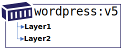
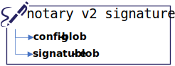
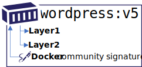
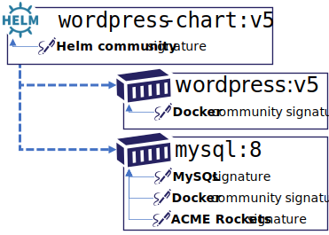
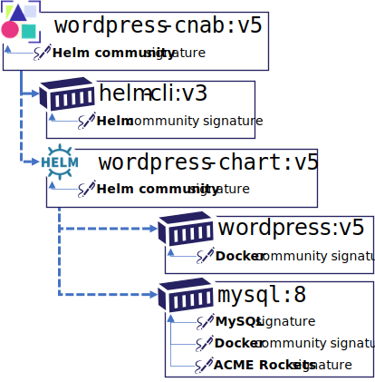
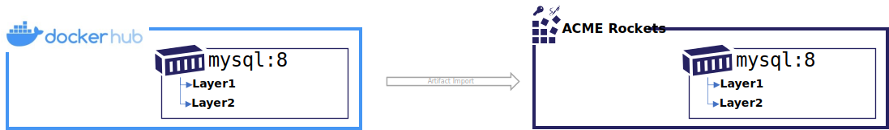
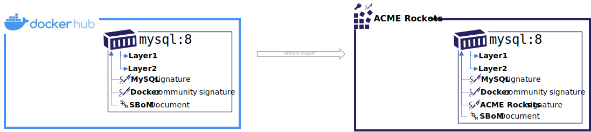
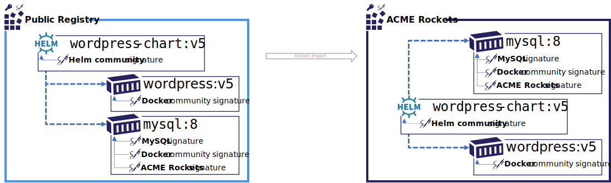
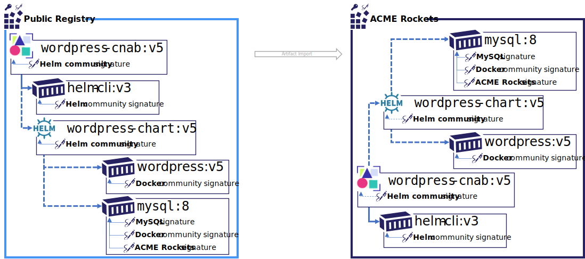

# OCI Artifact Manifest

The OCI artifact manifest provides a means to define a wide range of artifacts, including a chain of dependencies of related artifacts. It provides a means to define multiple collections of types, including blobs, dependent artifacts and referenced artifacts. These collections provide the information required for validating an artifact and registry management including reference counting, garbage collection and indexing.

OCI Artifact Manifests provide the following types of references:

1. Content that represents the artifact, persisted as blobs. These are analogues to layers from the OCI Image manifest and Config objects. Layers are renamed blobs as they represent a generic collection of content, as opposed to an ordered layered collection as defined by OCI Image Manifest. An artifact may treat them as ordered, but it is not required.
1. Loose references to other artifacts, used to complete a scenario, but may not be stored within the same repository or registry. These references are defined by the source artifact and known at the time of upload to a registry, such as a Helm chart that references other images. These references are included in the manifest and computed in the digest of the manifest.
1. References made by enhancements to the artifact, such as a Notary v2 signature or an SBoM. These references are unknown by the original artifact as they are added at a later time. A registry would need to index these references as registry apis would request all content related to the source artifact.

## Supported Artifact Types

Artifact Manifest is intended to support the following scenarios:

### OCI Image

An OCI Image is based on the oci-image-manifest. It's shown as a comparison to the examples below.



### Notary v2 Signature Persistance

A Notary v2 signature would persist as a manifest with a config object and a signature, persisted as a blobs.



The Notary v2 signature would reference an artifact, such as the `wordpress:v5` image above. Notice the directionality of the references. One or more signatures may be added to a registry after the image was persisted. While an image knows of it's layers, and a Notary v2 signature knows of its config and blob, the Notary v2 signature has a reference to the artifact its signing.



### Helm Charts & CNAB

A Helm chart can represent the images it references within the chart. These references are loose references as they may be persisted in different registries, or may change as a values file is updated. However, the chart may also be persisted together as a collection of artifacts in a registry.



A CNAB may also be persisted as a CNAB document that contains the configuration information, along with its invocation image. Notice the reference to the `helm-cli:v3` is a hard reference. This allows the helm-cli to be deleted *(ref-count -1)* when the parent cnab is deleted. As the CNAB references a Helm chart, the `wordpress-chart:v5` is also represented as a loose reference, which then references the images required to instance wordpress.



## Supported Scenarios

### Copy Container Images



Copying a container from a public registry to a private registry would involve `docker pull`, `docker tag` and `docker push`

```bash
docker pull mysql:8
docker tag mysql:8 registry.acmerockets.io/base-artifacts/mysql:8
docker push registry.acmerockets.io/base-artifacts/mysql:8
```

The above commands account for the image manifest and the associated layers. Note the directionality of the manifest to layers references. A manifest declares the layers that must be accounted for before a manifest may be considered valid within a registry. In addition, most registries implement layer de-duping and reference counting to avoid maintaining multiple copies of the same layers.

```json
{
  "schemaVersion": 2,
  "config": {
    "mediaType": "application/vnd.oci.image.config.v1+json",
    "size": 7097,
    "digest": "sha256:c8562eaf9d81c779cbfc318d6e01b8e6f86907f1d41233268a2ed83b2f34e748"
  },
  "layers": [
    {
      "mediaType": "application/vnd.oci.image.layer.v1.tar+gzip",
      "size": 27108069,
      "digest": "sha256:a076a628af6f7dcabc536bee373c0d9b48d9f0516788e64080c4e841746e6ce6"
    },
    {
      "mediaType": "application/vnd.oci.image.layer.v1.tar+gzip",
      "size": 1741,
      "digest": "sha256:f6c208f3f991dcbc417fed8efde391f887c0551d77ed0c1a125fd28f4841e1cc"
    }
  ]
}
```

### Container Image, with Signatures



In the above example, the layers have been removed for clarity. In this scenario, Notary v2 signatures have been added. Note the directionality of the Notary v2 signatures references. The `mysql:8` image has no reference to the signatures. The signatures may be added to existing artifacts.

From a user experience perspective, copying a container from a public registry to a private registry would likely be expected to copy the signatures alongside the artifact they've signed.

The `oci.artifact.manifest` supports the Notary v2 requirements, including:

- support for additive signatures, assuring the target manifest digest and tag do not change
- support for multiple signatures. In the above scenario, `mysql` signed the original image. As `mysql` was copied to Docker Hub, an additional `docker signature` was added, providing a certified content attestation. Once the image copy to ACME Rockets is completed, an additional `acmerockets signature` is added providing assurance the `mysql:8` image was security scanned and verified applicable to the ACME Rockets environment.

From a user experience, the signature artifacts have no unique value beyond the artifact they represent, therefore they would be persisted to a registry in a form by which they are known to copy with the artifact, and be deleted when the artifact they are associated with is deleted.

To support hard references, an additional dependencies collection is added to a new `application/vnd.oci.artifact.manifest.v1+json` schema. The `dependencies` collection declares the artifact the signature is dependent upon. Similar to pypi packages, the validation of dependencies are deferred. If the dependent artifacts are found, they are valid. Depending on the validation options, a signature may exist without its dependent artifact.

```json
{
  "mediaType": "application/vnd.oci.artifact.manifest.v1+json",
  "artifactType": "application/vnd.cncf.notary.v2",
  "config": {
    "mediaType": "application/vnd.cncf.notary.config.v2",
    "digest": "sha256:b5b2b2c507a0944348e0303114d8d93aaaa081732b86451d9bce1f432a537bc7",
    "size": 102
  },
  "blobs": [
    {
      "mediaType": "application/vnd.cncf.notary.v2.json",
      "digest": "sha256:9834876dcfb05cb167a5c24953eba58c4ac89b1adf57f28f2f9d09af107ee8f0",
      "size": 32654,
      "reference": "registry.wabbitnetworks.io"
    }
  ],
  "dependencies": [
    {
      "mediaType": "application/vnd.oci.image.manifest.v1",
      "digest": "sha256:3c3a4604a545cdc127456d94e421cd355bca5b528f4a9c1905b15da2eb4a4c6b",
      "size": 16724,
      "artifact": "mysql:8"
    }
  ]
}
```

#### OCI-Registry CLI

To copy the above image and the associated signatures, a new `oci-reg` cli is proposed.

The following command would copy the `mysql:8` image from docker hub to the acmerockets registry. The CLI could be run within the source or target cloud. 

```bash
oci-reg copy \
  --source hub.docker.io/mysql:8 \
  --target registry.acme-rockets.io/base-artifacts/mysql:8
```

The `oci-reg copy` command would:

- assure the manifest and layer/blob digests remain the same
- copy any artifacts that are dependent on the source artifact-manifest, persisting them in the target registry.

### Reference Artifacts

There are a set of artifact types that declare references to other artifacts that may, or may not be stored in the same registry. The reference is important to note, indicating copying to be capable between environments, as well as generalized validation scenarios.

#### Helm Reference



In the above scenario, a helm chart is copied from a public registry to the ACME Rockets registry. The `wordpress-chart:v5` is represented as an `application/vnd.oci.artifact.manifest.v1+json`. In addition to the Notary v2 signatures declaring a dependency on the `wordpress:v5` image, the `mysql:8` image, the `wordpress-chart:v5` helm chart can also represent signed content. The new references collection within the `oci.artifact.manifest` schema provides a means to identify the images the helm chart references.

```json
{
  "schemaVersion": 2,
  "mediaType": "application/vnd.oci.artifact.manifest.v1+json",
  "artifactType": "application/vnd.cncf.helm.v3",
  "config": {
    "mediaType": "application/vnd.cncf.helm.config.v1+json",
    "size": 0,
    "digest": "sha256:b5b2b2c507a0944348e0303114d8d93aaaa081732b86451d9bce1f432a537bc7"
  },
  "blobs": [
    {
      "mediaType": "application/vnd.cncf.helm.chart.v1.tar",
      "digest": "sha256:9834876dcfb05cb167a5c24953eba58c4ac89b1adf57f28f2f9d09af107ee8f0",
      "size": 32654
    },
    {
      "mediaType": "application/vnd.cncf.helm.values.v1.yaml",
      "digest": "sha256:3c3a4604a545cdc127456d94e421cd355bca5b528f4a9c1905b15da2eb4a4c6b",
      "size": 16724
    }
  ],
  "references": [
    {
      "reference": "wordpress:5.7",
      "mediaType": "application/vnd.oci.image.manifest.v1.config.json",
      "digest": "sha256:5c3a4604a545cdc127456d94e421cd355bca5b528f4a9c1905b15da2eb4a4c82",
      "size": 1510
    },
    {
      "reference": "mysql:8",
      "mediaType": "application/vnd.oci.image.manifest.v1.config.json",
      "digest": "sha256:8c3a4604a545cdc127456d94e421cd355bca5b528f4a9c1905b15da2eb4a4c31",
      "size": 1578
    }
  ]
}
```

#### CNAB Reference

A CNAB is yet another reference artifact. While the current CNAB spec incorporates the helm-cli ahd helm chart within an invocation image, the `artifact.manifest` provides more natural package management experiences where the references can be resolved based on the users intent.



Similar to the Helm example, a CNAB is copied from a public registry to the ACME Rockets registry. The `wordpress-cnab:v5` CNAB declares references to an invocation image that includes the `helm-cli`. This provides an environment to run `helm install`. The CNAB includes an additional refernece to `wordpress-chart:v5`. The chart includes references to the `wordpress:v5` and `mysql:8` images. As the `oci-reg copy` command is executed, the graph of references may be expanded. As the copy proceeds, only those artifacts that don't already exist in the target registry are required to be copied. The CNAB and Helm `artifact.manifest` may declare how strict they wish to couple their references to **stable tags** or **unique digests**

```json
{
  "schemaVersion": 2,
  "mediaType": "application/vnd.oci.artifact.manifest.v1+json",
  "artifactType": "application/vnd.cncf.cnab.v1",
  "config": {
    "mediaType": "application/vnd.cncf.cnab.config.v1+json",
    "size": 0,
    "digest": "sha256:b5b2b2c507a0944348e0303114d8d93aaaa081732b86451d9bce1f432a537bc7"
  },
  "blobs": [
    {
      "mediaType": "application/vnd.cncf.cnab.v1.tar",
      "digest": "sha256:9834876dcfb05cb167a5c24953eba58c4ac89b1adf57f28f2f9d09af107ee8f0",
      "size": 32654
    },
    {
      "mediaType": "application/vnd.cncf.cnab.params.v1.json",
      "digest": "sha256:3c3a4604a545cdc127456d94e421cd355bca5b528f4a9c1905b15da2eb4a4c6b",
      "size": 16724
    }
  ],
  "references": [
    {
      "reference": "wordpress-chart:v5",
      "mediaType": "application/vnd.cncf.helm.v1.config.json",
      "digest": "sha256:5c3a4604a545cdc127456d94e421cd355bca5b528f4a9c1905b15da2eb4a4c82",
      "size": 1510
    },
    {
      "reference": "helm-cli:3",
      "mediaType": "application/vnd.oci.image.manifest.v1.config.json",
      "digest": "sha256:8c3a4604a545cdc127456d94e421cd355bca5b528f4a9c1905b15da2eb4a4c31",
      "size": 1578
    }
  ]
}
```

----
# ADDITIONAL EDITING REQUIRED BEYOND THIS POINT
----

## Goals of Artifact Manifest

### Bi-directional Hierarchies

The OCI Distribution-spec 1.0 supports tops down hierarchies for tracking a manifest, a config object, and a collection of layers. This works well for immutable artifacts that are individually pushed to a registry. As an artifact is pushed, a manifest and digest of the manifest and it's referenced layers are computed.

The artifact-manifest will support additional references to existing content within a registry. Rather than update the original manifest with the additional objects, the additional object will provide the digest by which it's enhancing.

- `hello-world:v1` with a digest of `sha256:8b895ffec9fe33301cee47b0edc1600ea67604c3d138fa8ecb43ae62ad3b6fd4` is pushed to the registry
- A **S**oftware **B**ill **o**f **M**aterials (SBoM) for `hello-world:v1` is pushed to the registry. 
- A `hello-world:v1` SBoM is pushed, using digest of the `hello-world:v1` image.

In the above case, the original `hello-world:v1` image digest remains the same. Deployments of the `hello-world:v1` image can be made using the `hello-world:v1` tag, or the `sha256:8b89...` digest. With additional distribution-spec artifact APIs, requests may be made to list objects that reference the `hello-world:v1` artifact. In this case, returning the SBoM references.

### Artifact Copying Within and Across OCI Compliant Registries

Distribution-spec APIs will provide a means to discover, pull and push content within and across registries. No knowledge of the specific artifact type will be necessary.

### Delete Operations

Distribution-spec APIs will provide standard delete operations, including options for deleting referenced artifacts, or blocking a delete as the artifact is referenced by other artifacts.

- Which references should be deleted (ref counted)
- Which references should just reduce ref counting?
- Which artifacts should be blocked from deletion as another artifact depends upon it?
- Examples:
  - deleting the wordpress helm chart deletes the config, chart and values blobs
  - deleting the mysql image should warn if referenced by helm charts
  - deleting the wordpress chart removes a ref count to the mysql image, for mysql deletion

## Link Types

Artifact manifest will support bi-directional references enabling additional artifacts to be added to a registry after an artifact was persisted.

As artifacts reference others, hard and soft references will be supported, enabling artifacts to be individually deleted, or an extent of the dependency graph to be removed.

### Notes
Artifact-manifest has 3 collections
```json
{
  blobs:{}, physical content that is always associated with the object - just like oci image
  dependencies:{} - can be loosely defined (cnab, helm)
  references:{} - always copied (signature)
}
```

# copy the helm chart, the images (if found) and all signatures found
registry copy wordpress-helm:v1 

# copy with limited references (signatures but not source)
registry copy wordpress-helm:v1 --with-dependencies --filter-references "+notary.v2" "-gpl-source.v2"

## *Image Manifest* Property Descriptions

- **`schemaVersion`** *int*

  This REQUIRED property specifies the artifact manifest schema version.
  For this version of the specification, this MUST be `1`. The value of this MAY change if the schema is enhanced.

- **`mediaType`** *string*

  This property identifies the OCI Artifact Manifest schema. This field MUST be `"application/vnd.oci.artifact.manifest.v1+json"`

- **`config`** *[descriptor](descriptor.md)*

    This REQUIRED property references a configuration object for a container, by digest.
    Beyond the [descriptor requirements](descriptor.md#properties), the value has the following additional restrictions:

    - **`mediaType`** *string*

        This [descriptor property](descriptor.md#properties) has additional restrictions for `config`.
        Implementations MUST support at least the following media types:

        - [`application/vnd.oci.image.config.v1+json`](config.md)

        Manifests concerned with portability SHOULD use one of the above media types.

- **`layers`** *array of objects*

    Each item in the array MUST be a [descriptor](descriptor.md).
    The array MUST have the base layer at index 0.
    Subsequent layers MUST then follow in stack order (i.e. from `layers[0]` to `layers[len(layers)-1]`).
    The final filesystem layout MUST match the result of [applying](layer.md#applying-changesets) the layers to an empty directory.
    The [ownership, mode, and other attributes](layer.md#file-attributes) of the initial empty directory are unspecified.

    Beyond the [descriptor requirements](descriptor.md#properties), the value has the following additional restrictions:

    - **`mediaType`** *string*

        This [descriptor property](descriptor.md#properties) has additional restrictions for `layers[]`.
        Implementations MUST support at least the following media types:

        - [`application/vnd.oci.image.layer.v1.tar`](layer.md)
        - [`application/vnd.oci.image.layer.v1.tar+gzip`](layer.md#gzip-media-types)
        - [`application/vnd.oci.image.layer.nondistributable.v1.tar`](layer.md#non-distributable-layers)
        - [`application/vnd.oci.image.layer.nondistributable.v1.tar+gzip`](layer.md#gzip-media-types)

        Manifests concerned with portability SHOULD use one of the above media types.
        An encountered `mediaType` that is unknown to the implementation MUST be ignored.


        Entries in this field will frequently use the `+gzip` types.

- **`annotations`** *string-string map*

    This OPTIONAL property contains arbitrary metadata for the image manifest.
    This OPTIONAL property MUST use the [annotation rules](annotations.md#rules).

    See [Pre-Defined Annotation Keys](annotations.md#pre-defined-annotation-keys).

## Example Image Manifest

*Example showing an image manifest:*
```json,title=Manifest&mediatype=application/vnd.oci.image.manifest.v1%2Bjson
{
  "schemaVersion": 2,
  "config": {
    "mediaType": "application/vnd.oci.image.config.v1+json",
    "size": 7023,
    "digest": "sha256:b5b2b2c507a0944348e0303114d8d93aaaa081732b86451d9bce1f432a537bc7"
  },
  "layers": [
    {
      "mediaType": "application/vnd.oci.image.layer.v1.tar+gzip",
      "size": 32654,
      "digest": "sha256:9834876dcfb05cb167a5c24953eba58c4ac89b1adf57f28f2f9d09af107ee8f0"
    },
    {
      "mediaType": "application/vnd.oci.image.layer.v1.tar+gzip",
      "size": 16724,
      "digest": "sha256:3c3a4604a545cdc127456d94e421cd355bca5b528f4a9c1905b15da2eb4a4c6b"
    },
    {
      "mediaType": "application/vnd.oci.artifact.layer.v1.tar+gzip",
      "size": 73109,
      "digest": "sha256:ec4b8955958665577945c89419d1af06b5f7636b4ac3da7f12184802ad867736"
    }
  ],
  "annotations": {
    "com.example.key1": "value1",
    "com.example.key2": "value2"
  }
}
```

## Pre-Defined Annotation Keys

This specification defines the following annotation keys, intended for but not limited to  Artifact Manifest authors:
* **org.opencontainers.artifact.created** date and time on which the artifact was built (string, date-time as defined by [RFC 3339](https://tools.ietf.org/html/rfc3339#section-5.6)).
* **org.opencontainers.artifact.authors** contact details of the people or organization responsible for the artifact (freeform string)
* **org.opencontainers.artifact.url** URL to find more information on the artifact (string)
* **org.opencontainers.artifact.documentation** URL to get documentation on the artifact (string)
* **org.opencontainers.artifact.source** URL to get source code for building the artifact (string)
* **org.opencontainers.artifact.version** version of the packaged software
  * The version MAY match a label or tag in the source code repository
  * version MAY be [Semantic versioning-compatible](http://semver.org/)
* **org.opencontainers.artifact.revision** Source control revision identifier for the packaged software.
* **org.opencontainers.artifact.vendor** Name of the distributing entity, organization or individual.
* **org.opencontainers.artifact.licenses** License(s) under which contained software is distributed as an [SPDX License Expression][spdx-license-expression].
* **org.opencontainers.artifact.title** Human-readable title of the artifact (string)
* **org.opencontainers.artifact.description** Human-readable description of the software packaged in the artifact (string)

## Setting meta-data

Should be as simple as setting a name/value pair for a specific tag and/or digest
Setting a name/value pair for a tag will assign the meta-data to the digest currently associated with the tag. We do not currently see the need to set meta-data specific to a tag.

Setting the git digest to a tagged artifact:

```shell
/charts/wordpress:5.7
{
  "name": "git.digest",
  "value": "1124125"
}
```

Setting the contact info to a tagged artifact:

```shell
/charts/wordpress:5.7
{
  "name": "oci.meta-data.contact",
  "value": '{
    "first": "Steve",
    "last": "Lasker",
    "email" "stevenlasker@hotmail.com"
    }'
}
```

## Collections

## Parent

Parent elements MUST NOT have tags as they are attributions to the parent element

Optional elements are optional as they represent metadata that has persistance.

### Blobs

All blobs are considered to be hard dependencies. These support ref counting, but would be deleted when the manifest is deleted.

### Dependencies

All dependencies are considered soft dependencies.


## Pushing Artifact Manifests

Manifest validation
Each mediaType is evaluated. If the manifestType is 

## Open Questions

Should the references collection support additional types, like loose urls