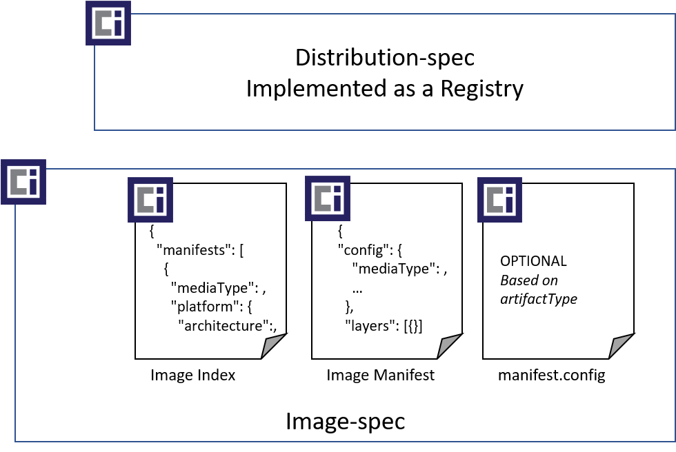
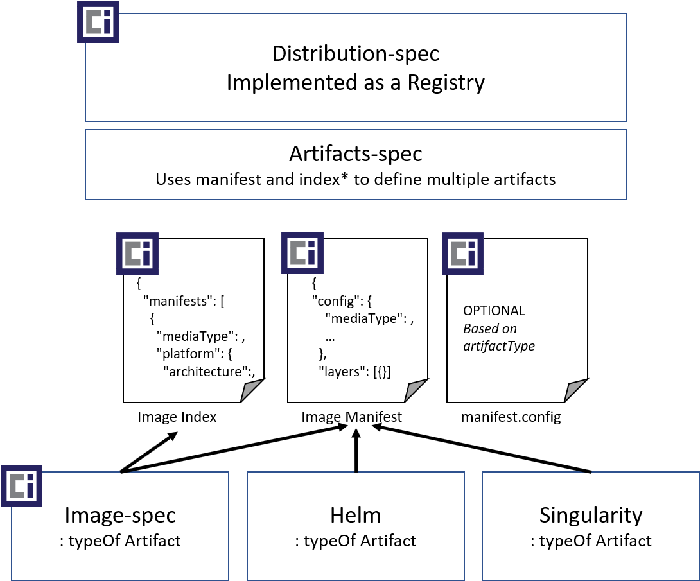

# Open Container Initiative

## Artifacts Specification

This Artifacts Spec provides a reference for artifact authors and registry implementors to support new artifact types with pre 1.0 implementations of the [distribution-spec][distribution-spec]. More particularly this repository (spec) has been tasked by the OCI TOB to serve 3 primary goals:

1. **Artifact Authors** - guidance for authoring new artifact types. Including a clearing house for [well known][def-well-known-types] artifact types.
1. **Registry Operators and Vendors** - guidance for how operators and vendors can support new artifact types, including how they can opt-in or out of well known artifact types. Registry operators that already implement `mediaType` filtering will not have to change. The artifact repo will provide context on how new `mediaTypes` can be used, and how `mediaTypes` can be associated with a type of artifact.
1. **Clearing House for [Well-known Artifacts][def-well-known-types]** - artifact authors can submit their artifact definitions, providing registry operators a list by which they can easily support.

[Artifacts v1.0][artifacts] presumes a refactoring of the [OCI Image-spec 1.0][image-spec] and the pending [OCI Distribution-spec 1.0][distribution-spec] to refactor [manifest][image-manifest] and [index][image-index] to separately versioned specs. The refactoring is for clarity of use, and is not required to support artifacts.

**Reference**:

- [Need a Working Group for Updating the distribution-spec #9](https://github.com/opencontainers/artifacts/issues/9)
- [Need a Working Group for Updating the image-spec #10](https://github.com/opencontainers/artifacts/issues/10)

**v1.0 of the image-spec** defines index and manifest.



**Artifacts 1.0** visualizes a refactoring of index and manifest.



## Table of Contents

- [Scope](#scope)
- [Defining OCI Artifact Types](#defining-oci-artifact-types)
- [Authoring an OCI Artifacts](#authoring-an-oci-artifacts)
- [Defining Supported Layer Types](#defining-supported-layer-types)
- [Optional: Defining Config Schema](#optional-defining-config-schema)
- [Optional: Defining Artifact Publisher Manifests](#optional-defining-artifact-publisher-manifests)
- [Registering Unique Types](#registering-unique-types)
- [References](#references)

## Scope

[Artifacts v1.0][artifacts] is dependent on [OCI manifest][image-manifest] 1.0 to represent individual artifacts including [OCI Image][image-spec], [Helm][helm] and [Singularity][singularity].

### Future Scope

Future versions will support new artifact types that represent collections of artifacts using [OCI Index][image-index]. A means to identify an index as a type of artifact will be required.

## Defining OCI Artifact Types

As registries become content addressable distribution points, tools that pull artifacts must know if they can operate on the artifact. Artifact types are equivalent to file extensions.

- When users open files, the host operating system typically launches the appropriate program.
- When users open a file, from within a program, the open dialog filters to the supported types.
- When search or security software scan the contents of a storage solution, the software must to know how to process the different types of content.
- When users view the contents of a storage solution, they see the textual and visual indications of the type.

OCI Artifacts provides these core capabilities to [OCI distribution spec][distribution-spec] based registries.

### Visualizing Artifacts

The manifest `config.mediaType` is the equivalent to a file extension, enabling artifact type differentiation.

Once complete, Artifacts can be identified and visualized as the following:

|Icon|Artifact|`config.mediaType`|
|-|-|-|
||[OCI Image][image-spec]|`application/vnd.oci.image.config.v1+json`|
||[Helm Chart](https://helm.sh)|`application/vnd.cncf.helm.chart.config.v1+json`|
||[Singularity][singularity], by [Sylabs][sylabs]|`application/vnd.sylabs.sif.config.v1+json`|

## Authoring an OCI Artifacts

Authoring Artifacts involves the following steps:

1. [Define a unique Artifact type](#defining-a-unique-artifact-type)
1. Define the format for other tools to operate upon the type.
1. Define human elements, such as an icon and localized string to be displayed to users.
1. Optional: Register the unique `mediaType` with [IANA][iana-registry-media-types].
1. Optional: Publish as a [well-known type][def-well-known-types] for registries to consume.

### Defining a Unique Artifact Type

A unique artifact is similar to defining a file extension. Defining a unique Artifact allows various tools to know how to uniquely work with the type. It allows a registry to display the type, and vulnerability scanners a means to know if and how they should scan the contents.

Defining a unique type involves uniqueness for computer processing, and uniqueness for humans. See [Defining Artifact Publisher Manifests](#optional-defining-artifact-publisher-manifests) for human readability.

For computer processing, artifacts are defined by setting the `manifest.config.mediaType` to a globally unique value.

> **Note:** The `config.mediaType` of `application/vnd.oci.image.config.v1+json` is reserved for artifacts intended to be run and instanced by [docker][docker], [containerd][containerd] and other [OCI Image][image-spec] runtimes and tool chains.

Each new artifact type MUST be uniquely defined. See [registering unique types with IANA](#registering-unique-types) for registering unique [well-known][def-well-known-types] mediaTypes.

Each `mediaType` SHOULD use all lower case characters. Multi-part names MAY concatenate words, or use `-` to separate words. eg: (`subtype`, `sub-type`)

The following `mediaType` format is used to differentiate the type of artifact:

`[registration-tree]`.`[org|company|entity]`.`[objectType]`.`[optional-subType]`.config.`[version]`+`[optionalConfigFormat]`

- **`registration-tree`** - represents an IANA root tree. See [iana registration trees][iana-trees] for public and private tree options.
- **`org|company|entity`** - represents an open source foundation (`oci`, `cncf`) or a company (`microsoft`, `ibm`) or some unique entity.
- **`objectType`** - a value representing the short name of the type.
- **`optionalSubType`** - provides additional extensibility of an `objectType`
- **`version`** - provides artifact authors the ability to revision their schemas and formatting, enabling tools to identify which format they will process.
- **`optionalConfigFormat`** - while `config.mediaType` represents the unique identifier of an artifact, providing a config object is optional. If a config object is provided. `.json`, `.yaml|yml` or other standard textual formats are preferred. By utilizing standard text formats, registry operators MAY parse the contents to provide additional context to users. If the config object is null, the extension MUST be empty.

### Example `config.mediaTypes`

|Artifact Type|mediaType|
|-|-|
| null config | `application/vnd.oci.null-sample.config.v1`|
| Config in `.json` | `application/vnd.oci.json-sample.config.v2+json`|
| Config in `.yaml` | `application/vnd.oci.yaml-sample.config.v3+yaml`|

See [visualizing artifacts](#visualizing-artifacts) for additional `mediaType` examples.

## Defining Supported Layer Types

The content of an artifact is represented through a collection of layers and an optional config object. The layers of an Artifact may be independent files, collections of files, or ordinal layered tarballs persisted as blobs within a registries storage provider.

Defining artifact layers involves:

1. [Defining layer content, understanding layer de-duping](#layer-content-format)
1. [Optional versioning of layer content](#layer-versioning)
1. [Defining unique `layer.mediaTypes`](#defining-layermediatypes)

As an example, [OCI Images][image-layer] are represented through an ordinal collection of tar archives. Each blob represents a layer. Each layer overlays the previous layer.

Some artifacts may be represented as a single file, such as config artifact representing a deployment specification. While other artifacts may include a config object, and a collection of binaries compressed as yet another layer. By separating the layers, the artifact author can benefit from layer de-duplication and concurrent downloading of each layer using various distribution-spec clients. How an artifact client processes layers, merging them with overlay, or extracting them to different locations or hosts is up to the artifact authors.

### Layer Content Format

The content layer format is up to the artifact author and may utilize standard or custom formats. Authors are encouraged to utilize existing formats which may benefit from existing libraries to parse those formats. Authors may choose to persist individual files with standard or custom formats, such as `.config`, `.json`, `.bin`, `.sif`, or store a collection of files as `.tar` archive. Optionally, the author MAY choose to compress the contents. The extension of the `layer.mediaType` SHOULD reflect the format of the blob and its optional compression.

Artifacts authors may define different layers for a range of reasons:

1. Split layers due to size:
    - Splitting an artifact into multiple layers enables concurrent downloading.
    - Some artifacts will benefit from common layers, as OCI Images have common base layers and/or common framework/runtime layers.  
    In this case, the layers are ordinal where each layer overlays the previous layer, creating a unified collection of files.  
    All layer types are the same, with the position in the index being the important aspect.
1. Split layers for different groupings, reuse and optimization:
    - An artifact may have non-unique environmental config and runtime collections of files. The runtime layer is sent to a host, while the configuration information may be sent to another location on the same host, or to a different host altogether.
    - Layers may split for different localization options, where an artifact client can determine which layers it requires for locales and language requirements. The runtime layer, or the localization layers may be individually updated, isolating the storage and download time for delta changes.
    - Layers may include optional source code, licenses or software bill of materials (SBoM) that are required for legal requirements or policy management. Different elements of a pipeline may pull the layers they require, while saving bandwidth, memory and compute processing for the layers they don't require.
    - In these cases, the ordinal positioning of the layer isn't important, rather the sub-type of the layer identifies its purpose.

#### De-duping Layers

When designing layer formats, consider how a registry may de-dupe layers that share the same content across different artifacts. Layers may be shared across different instances of an artifact as they're persisted to a registry. The registry may handle de-duping based on the digest of each layer. Artifact layers types are not expected, nor required to be shared across different artifact types. A layer type that represents an OCI Image is not expected to be shared with a Helm Chart. However, two helm charts that have the same content may be de-duped within the registry. The `layer.mediaType` provides the definition of the contents.

### Layer Versioning

Layer formats that may change should define a version to future proof new enhancements. How the artifact tooling processes forward and backward compatibility is up to the artifact and tooling authors.

### Defining `layer.mediaTypes`

`layer.mediaTypes` fall into 2 categories:

1. **Existing generic formats**: as defined by [IANA][iana-media-types] for simple layer types.  
    These types are not artifact nor vendor|org|entity specific, nor are they versioned.
    - [application/json](https://www.iana.org/assignments/media-types/application/json)
    - [application/text/*](https://www.iana.org/assignments/media-types/media-types.xhtml#text)
    - [application/xml](https://www.iana.org/assignments/media-types/application/xml)
1. **Vendor|Org|Entity definitions**: identify different versioned layer types within the same artifact. Each layer may use an existing IANA format, but represent different usages within the artifact type.

**Existing generic formats** enable simple scenarios, where there's differentiation between the different layers. While **Vendor|Org|Entity definitions** allow different layers to be handled individually without assuming ordinal positioning.

**Existing generic formats** follow a similar convention to manifests, utilizing the `layer.mediaType` with the following format:  
`[registration-tree]`.`[org|company|entity]`.`[layerType]`.`[optionalLayerSubType]`.layer.`[optionalVersion]`.`[fileFormat]`+`[optionalCompressionFormat]`

- **`registration-tree`** - represents an IANA root tree. See [iana registration trees][iana-trees] for public and private tree options.
- **`org|company|entity`** - represents an open source foundation (`oci`, `cncf`), a company or some unique entity.
- **`layerType`** - a value representing the short name of the type.
- **`optionalLayerSubType`** - provides additional extensibility of an `layerType`
- **`optionalVersion`** - provides artifact authors the ability to revision their schemas and formatting, enabling tools to identify which format they will process. The content format (json, yaml) may not revision, but the content within the layer may evolve. Using a version enables artifact tools to identify the format for processing.
- **`fileFormat`** - provides a standard, or custom formats, enabling artifact authors to leverage existing or custom content processing libraries.
- **`optionalCompressionFormat`** - in addition to the fileFormat, what optional compression format is used. (eg: `+gzip`, `+zstd`)

### Example Layer Types

|Artifact Type|mediaType|
|-|-|
|Simple Text File Layer|`application/text`|
|Non-compressed OCI Image Layer|`application/vnd.oci.image.layer.v1.tar`|
|[gzip] Compressed OCI Image Layer|`application/vnd.oci.image.layer.v1.tar+gzip`|
|[gzip] Compressed Docker Image Layer|`application/vnd.docker.image.rootfs.diff.tar+gzip`|
|Non-compressed Helm Chart Layer|`application/vnd.cncf.helm.chart.layer.v1.tar`|
|[gzip] Compressed Helm Chart Layer|`application/vnd.cncf.helm.chart.layer.v1.tar+gzip`|
|Singularity SIF Layer|`application/vnd.sylabs.sif.layer.v1.sif`|
|[gzip] Compressed Sample Text File Layer|`application/vnd.sample.text.layer.v1.txt+gzip`|
|[zstd] Compressed Sample Text File Layer|`application/vnd.sample.text.layer.v1.txt+zstd`|

## Optional: Defining Config Schema

When defining an artifact type, the persistance of the artifact may be broken up into content and configuration. Configuration can be stored as a blob, or it can be stored and referenced by the `manifest.config`.

While the value of `manifest.config.mediaType` is used to determine the artifact type, the persistance of a `config` object is OPTIONAL. Artifacts can push a null reference for `config.json` persistance.

Some benefits of placing content in `manifest.config` include:

- Tooling can pull configuration prior to any blobs. Using the config to determine how and where the blob should be instanced, an artifact tool might send blob request to another compute instance, such as OCI Image layers being sent to a Windows or Linux Host.
- Registries may opt-into parsing the configuration if it provides meaningful top-level information. [OCI Image Config][image-spec-config] stores `OS`, `Architecture` and `Platform` information that some registry operators may wish to display. The config is easy to pull & parse, as opposed to getting a layer url to pull, possibly decompress and parse.

Distribution instances MAY:

- Parse and process the contents of  `manifest.config`, based on the provided schema of `manifest.config.mediaType`, offering additional information or actions.
- Ignore the contents and validation of the `config` object.

## Optional: Defining Artifact Publisher Manifests

Artifact authors may wish to publish their types as [well known types][def-well-known-types] for registry operators to consume. By publishing an `artifactManifest.json`, registry operators can parse information for validation, registry display and search results.

An `artifactType.json` file is defined using the [following schema](artifactTypes/artifactTypeSchema.0.1.json).

- **`mediaType`** *string*  
  This REQUIRED property uniquely identifies the artifact for computer consumption. It may be owned by an org or a company and MUST be [registered as globally unique](#registering-unique-types) and versioned.
- **`title`** *string-string map*  
  This REQUIRED property must have at least one value, representing the name of the type displayed for human consumption. The title may be displayed in a repository listing, or registry tooling.  
  Title is a collection of localized strings, indexed with [ISO Language Codes][iso-lang-codes].
  - **`locale`** *string*  
    2-2 language codes representing the country and locale. [ISO Language Codes][iso-lang-codes]
  - **`title`** *string*  
Localized title. The max length MUST not exceed 30 characters and MUST not encode formatting characters.
- **`description`** *string-string map*  
    This REQUIRED property must have at least one value, providing a short description of the type for human consumption. The description may be displayed in repository listings or registry tooling.  
    Description is a collection of localized strings, indexed with [ISO Language Codes][iso-lang-codes].  
  - **`locale`** *string*  
    2-2 language codes representing the country and locale. [ISO Language Codes][iso-lang-codes]
  - **`description`** *string*  
Localized description. The max length MUST not exceed 255 characters and MUST not encode formatting characters.
- **`moreInfoUrl`** *url*  
This OPTIONAL property provides additional details, intended for consumers of the type. This is most often a marketing & awareness overview page.
- **`specUrl`** *url*  
This OPTIONAL property references a spec, providing additional details on the type.
- **`tools`** *string-string map*  
  This OPTIONAL property provides a collection of tools that may be used with artifact type. The property is intended for end users to find more info on how to find and install related tools. Registry operators MAY provide links to the tools in their repository listing.
  - **`url`** *url*  
    This REQUIRED property links to a page where users can download the tool. The URL MAY be a direct link to a download URL, or a link to documentation for how to download the tool.
  - **`title`** *string-string map*  
    This OPTIONAL property represents the name of the tool, displayed for human consumption. The title may be displayed in a repository listing, or registry tooling.  
    Title is a collection of localized strings, indexed with [ISO Language Codes][iso-lang-codes].
    - **`locale`** *string*  
      2-2 language codes representing the country and locale. [ISO Language Codes][iso-lang-codes]
    - **`title`** *string*  
Localized title. The max length MUST not exceed 30 characters and MUST not encode formatting characters.
- **`configSchemaReferenceUrl`** *url*  
This OPTIONAL property provides a schema reference for the artifact config object. The schema is provided for registry operators and tools to optionally validate and process information within the config. A registry operator MAY wish to present information, such as the OCI image architecture type. Each versioned artifact type would have a unique version, possibly referencing a unique schema version. To version the schema, the artifactType MUST also be versioned.
- **`layerMediaTypes`** string-string map  
  This REQUIRED property must have at least one value, representing one or more layer `mediaTypes` used by the artifact.  
  Layer mediaTypes MAY be unique to the specific artifact, or they may [use generic mediaTypes](#defining-layermediatypes).
  Layer mediaTypes are NOT REQUIRED to be unique across different artifact types when artifacts intend to share layers across different artifact tooling.  
  Registry operators MAY choose to validate layers associated with a specific artifact type. Providing the supported layers enables registry operators to know the supported `mediaTypes`.

  - **`mediaType`** *string*  
    This REQUIRED property represents a valid layer `mediaTypes` for the artifact.

### Artifact Publisher Manifest Type Example

The following is an example of an unknown artifact type.

```json
{
  "mediaType": "application/vnd.unknown.config.v1",
  "spec": "https://github.com/opencontainers/artifacts",
  "title": {
    "locale": "en-US",
    "title": "An unknown type"
  },
  "description": {
    "locale": "en-US",
    "description": "An undefined type - USE ONLY FOR DEVELOPMENT"
  },
  "url": "https://github.com/opencontainers/artifacts",
  "tools":[
    {
      "title": {
        "locale": "en-US",
        "title": "ORAS"
      },
      "url": "https://github.com/deislabs/oras"
    }
  ],
  "configSchemaReference": "",
  "layerMediaTypes": [
    "application/tar",
    "application/txt",
    "application/text/yaml"
    "application/vnd.oci.unknown.layer.v1.bin",
    "application/vnd.oci.unknown.layer.v1.json",
  ]
}
```

## Registering Unique Types

TODO:
[IANA Registration Requirements](https://tools.ietf.org/html/rfc6838#section-4)

## References

RFC reference:

- [RFC 6838][rfc-6838]
- [RFC 5226][rfc-5226]

[annotations]:          https://github.com/opencontainers/image-spec/blob/master/annotations.md
[artifacts]:            README.md
[containerd]:           https://containerd.io/
[def-registry]:         definitions-terms.md#registry
[def-well-known-types]: definitions-terms.md#well-known-type
[def-yass]:             definitions-terms.md#yass
[distribution-spec]:    https://github.com/opencontainers/distribution-spec/
[docker]:               https://github.com/moby/moby
[gzip]:                 https://tools.ietf.org/html/rfc1952
[helm]:                 https://github.com/helm/helm
[iana-registry-media-types]:     https://www.iana.org/form/media-types
[iana-trees]:           https://tools.ietf.org/html/rfc6838#section-3
[iana-media-types]:     https://www.iana.org/assignments/media-types/media-types.xhtml
[image-manifest]:       https://github.com/opencontainers/image-spec/blob/master/manifest.md
[image-index]:          https://github.com/opencontainers/image-spec/blob/master/image-index.md
[image-layer]:          https://github.com/opencontainers/image-spec/blob/master/layer.md
[image-spec]:           https://github.com/opencontainers/image-spec/
[image-spec-config]:    https://github.com/opencontainers/image-spec/blob/master/config.md
[distribution]:         https://github.com/docker/distribution
[rfc-5226]:             https://tools.ietf.org/html/rfc5226
[rfc-6838]:             https://tools.ietf.org/html/rfc6838
[singularity]:          https://github.com/sylabs/singularity
[sylabs]:               https://sylabs.io/
[zstd]:                 https://tools.ietf.org/html/rfc8478
